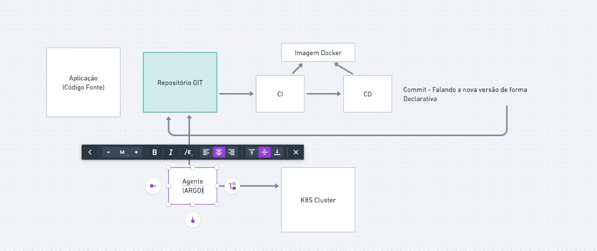
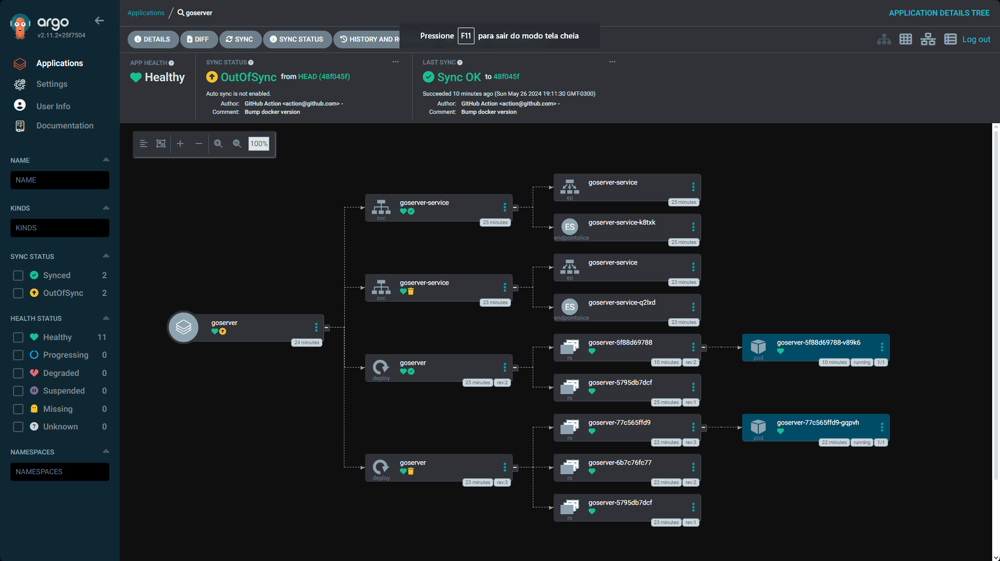

# GitOps

### Fluxo de integração continua

### Criação do cluster
    kind create cluster --name=gitopsfc
    kubectl cluster-info --context kind-gitopsfc
    kubectl apply -f .\k8s\gitopsfc\
    kubectl get deploy
    kubectl get service

### Com Kustomize
    kustomize edit 
    kubectl apply -k .\k8s\gitopsfc

### Instalando ARGO CD

    kubectl create namespace argocd
    kubectl apply -n argocd -f https://raw.githubusercontent.com/argoproj/argo-cd/stable/manifests/install.yaml
    kubectl get all -n argocd
    kubectl get secret argocd-initial-admin-secret -n argocd -o jsonpath="{.data.password}" (é necessario decodificar a senha em base64)

